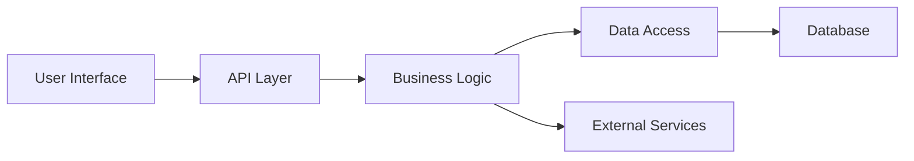

# Architecture Overview

## Components

- **User Interface**: Front‑end (HTML/JS) built with vanilla CSS.
- **API Layer**: Express‑style routes handling requests.
- **Business Logic**: Core TypeScript modules.
- **Data Access**: Repository pattern for SQLite/JSON storage.
- **Database**: Simple SQLite file stored in `data/`.
- **External Services**: Optional integrations (e.g., email, analytics).

## Deployment

1. Install dependencies.
2. Run `npm run dev` to start the dev server.
3. Use `npm run build` for production bundle (if needed).
