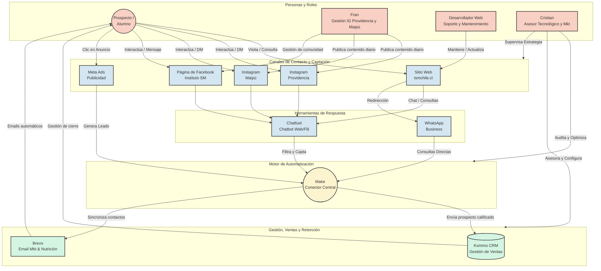

# Ecosistema Digital - Instituto Santa María (ISM)

## Visión General del Ecosistema

El siguiente diagrama ilustra cómo interactúan los diferentes actores (equipo de trabajo, prospectos), las plataformas digitales y los sistemas internos para crear un flujo de trabajo optimizado y centralizado.

---

## Propuesta Explicativa para el Cliente

*(Puedes copiar y adaptar el siguiente texto para presentárselo al cliente / equipo directivo del Instituto SM)*

**Asunto:** Presentación de nuestro Ecosistema Digital Integrado para el Instituto SM

Hola equipo,

Quiero compartir con ustedes el mapa conceptual de cómo estamos estructurando y unificando todo nuestro ecosistema digital. El objetivo de este modelo es asegurar que ningún esfuerzo de marketing o contacto de un alumno se pierda, garantizando un flujo ordenado, medible y altamente profesional.

¿Cómo funciona este ecosistema? Lo dividimos en 4 bloques principales:

1.  **Nuestros Canales de Captación (La Vitrina):** Aquí es donde entran nuestras sedes. Bajo la gestión unificada de **Fran**, nuestros Instagrams (Providencia y Maipú), nuestra página de **Facebook**, y nuestro **Sitio Web** (mantenido por nuestro equipo de desarrollo aliado) funcionarán en sincronía. Cada publicación diaria sobre lo que pasa en nuestras aulas alimentará estos canales para atraer a los alumnos correctos.
2.  **Atención Inmediata (La Recepción Digital):** Cuando un prospecto llega interesado por nuestros canales, entra en acción **Chatfuel** (nuestro chatbot) y **WhatsApp Business**. Esto asegura que cualquier persona que visite la web o nuestras redes reciba una respuesta inmediata y sea filtrada correctamente 24/7.
3.  **El Cerebro Conector (Make):** En lugar de tener plataformas desconectadas, utilizaremos **Make** como el puente central. Su trabajo es invisible pero crucial: toma los datos de quien nos escribe en la web, en redes o en WhatsApp, y los organiza automáticamente sin que nadie tenga que copiar y pegar datos a mano.
4.  **El Cierre y la Relación (Kommo y Brevo):** Una vez que Make toma un contacto, lo envía a nuestro equipo comercial a través de **Kommo CRM** para cerrar la matrícula. Simultáneamente, el contacto entra a **Brevo**, lo que nos permite mantener una relación a largo plazo enviando correos automatizados (novedades, inicios de clases, recordatorios).

**Mi rol en este proceso:**
Estaré auditando, configurando y optimizando este flujo. Me aseguraré de que las piezas (Meta, Kommo, Make, Chatfuel y Brevo) estén 100% operativas y comunicándose a la perfección. Mi objetivo en estos 3 meses es transferirles el conocimiento necesario para que ustedes tengan el control total de esta maquinaria, mientras los asesoro tecnológicamente para tomar las mejores decisiones.

Quedo atento a cualquier duda sobre este flujo.

Saludos,
**Cristian Díaz**
*Asesor de Tecnología y Marketing Digital*
